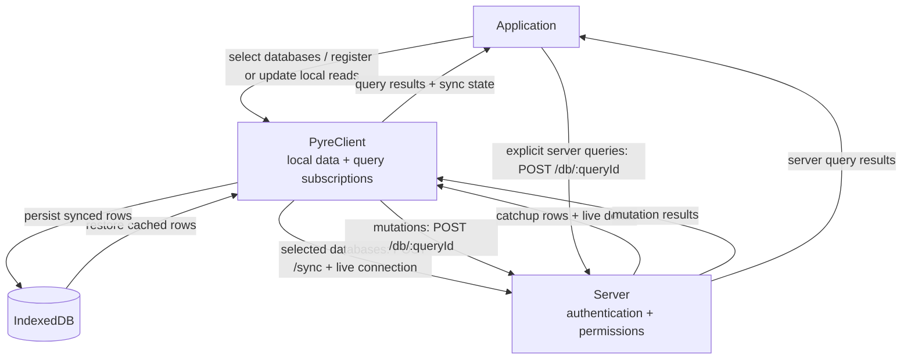

# Sync Setup

This guide assumes you already know the basic Pyre workflow from [Getting Started](./getting-started.md): schema, database, queries, `pyre check`, and `pyre generate`.

Use this guide when you want:

- a Pyre-backed server
- live sync on the client
- local query subscriptions over synced data
- explicit composed writes with optimistic feedback through the same local read model

If your main goal is Elm port wiring, also see [Elm + Sync Runtime Setup](./elm-sync.md).

## Quick Start

The shortest sync path looks like this:

1. Define server-side schema permissions and a local query using ordinary inputs.
2. Apply the schema to a database with `pyre migrate db/app.db --push`.
3. Run `pyre generate`.
4. Start a Pyre-backed server that exposes `/sync`, `/sync/events`, and `/db`.
5. Create a `PyreClient` in your browser app.
6. Select databases from the application's accessible IDs and register local queries.
7. Construct generated edits and submit them explicitly when the user saves.

The rest of this guide walks through those steps.

For browser sync, use `@pyre/client` from the same GitHub Release used for the compiler, `@pyre/core`, and `@pyre/server` in [Getting Started](./getting-started.md). Replace every `VERSION` in this template with that release's version; use matching workspace packages for unreleased development code.

```json
{
  "dependencies": {
    "@pyre/client": "https://github.com/mdgriffith/pyre/releases/download/version-VERSION/pyre-client-VERSION.tgz"
  },
  "overrides": {
    "@pyre/core": "https://github.com/mdgriffith/pyre/releases/download/version-VERSION/pyre-core-VERSION.tgz",
    "@pyre/client": "https://github.com/mdgriffith/pyre/releases/download/version-VERSION/pyre-client-VERSION.tgz"
  }
}
```

## 1. Define Server Permissions And Local Queries

Define the shared server session in `pyre/session.pyre`:

```pyre
session {
    userId Int
}
```

Define records and permissions in `pyre/schema.pyre`:

```pyre
record User {
    @allow(query, insert, update, delete) { ownerId == Session.userId }

    id Id.Uuid @id
    ownerId Int
    name String
}
```

Define the local query in `pyre/query.pyre`:

```pyre
query GetUser($id: User.id) {
    user {
        @where { id == $id }

        id
        name
    }
}
```

The server validates its authenticated session against the schema and enforces the schema permissions when selecting data to sync. `GetUser` remains a normal local query: its only explicit filter uses the ordinary `$id` input, and its only `Session` dependency is in server-side schema permissions.

Synced records require one non-null UUID primary key. `ownerId` here is an ordinary integer from the external authentication system, not this record's primary key. Generated `User.create` allocates the row's UUIDv7; updates and queries use that UUID. See [Schema Identity](./schema.md#identity-and-syncability).

For explicit `Session` filters and their ordinary-input alternative, see [Local Queries And Session](./query.md#local-queries-and-session).

## 2. Apply The Schema To A Database

For a local sync prototype, use direct push:

```bash
pyre migrate db/app.db --push
```

For checked-in migration files instead of direct push, see [Migration Guide](./migrations.md).

For each syncable table, Pyre manages an `(updatedAt, @id)` index used by catch-up pagination. Query-only namespaces marked `@syncable(false)` do not receive this index; explicitly declared indexes are preserved.

## 3. Generate Artifacts

```bash
pyre generate
```

Generated output includes:

```text
pyre/generated/
├── client/
│   └── elm/
│       ├── Pyre.elm
│       └── Query/
└── typescript/
    ├── core/
    ├── seed.ts
    ├── server.ts
    └── run.ts
```

The important pieces for sync are:

- `typescript/core/`: schema metadata and query metadata
- `typescript/core/edits.ts`: typed CRUD builders, branded IDs, `batch`, and namespace-bearing `database` targets
- `client/elm/`: generated Elm sync/query surface
- `typescript/server.ts`: query metadata consumed by the server sync runtime

## 4. Run A Pyre-Backed Server

You need a server that exposes the standard Pyre endpoints:

```text
POST /sync
GET  /sync/events
POST /db/:queryId
```

You have two common options:

### Option A: Use `pyre serve`

This is the fastest way to get a working server:

```bash
pyre serve db/app.db --dev-session '{"userId":1}'
```

See [pyre-serve.md](./pyre-serve.md) for operational details.

### Option B: Use Your Own Server

Use the generated server target to run queries against your database inside your own app server:

```typescript
import { createClient } from '@libsql/client';
import * as Sync from '@pyre/server/sync';
import { queries } from './pyre/generated/typescript/server';

const db = createClient({
  url: 'file:./db/app.db',
});

await Sync.init();
await Sync.loadSchemaFromDatabase(db);

// These values normally come from the authenticated request and route.
const queryId = request.params.queryId;
const args = await request.json();
if (queryId === '$batch' && !Array.isArray(args)) {
  return Response.json({ errorType: 'InvalidInput', message: 'Expected an operation array' }, { status: 400 });
}
const session = { userId: authenticatedUser.id };
const databaseId = 'main';

const result = await Sync.run(
  db,
  queries,
  queryId === '$batch' ? args : queryId,
  args,
  session,
  connectionsForDatabase(databaseId),
  databaseId,
);

if (result.kind === 'error') {
  return Response.json(result.error, {
    status: result.error?.errorType === 'OutcomeUnknown' ? 500 : 400,
  });
}

await result.sync((sessionId, message) => {
  sendPyreSyncMessage(databaseId, sessionId, message);
});

return Response.json(result.response);
```

`queryId` is the generated interface ID sent by the client, not a source-level name such as `GetUser`. A custom server must authenticate each request, construct the Pyre session, authorize the requested `databaseId`, and map it to the correct database connection. Keep live-sync connections partitioned by database; never broadcast deltas across database IDs. See [Multi-Database Server Requirements](./multi-database-upgrade.md#server-requirements) for route wiring.

`$batch` is the composed-operation route ID. Its body is an array of `{ queryId, input }` descriptors; pass that array as the third argument to `Sync.run`. Passing the literal string `'$batch'` to the TypeScript executor would look up a named query instead. The built-in Rust server handles this route itself.

Call `result.sync` before serializing a successful sync response, even when no live clients are connected. It publishes final permission-filtered rows/removals and wraps the result as `{ databaseEpoch, serverRevision, sync, result }` when there are affected rows. Revisions are allocated inside the write transaction, not during later publication. HTTP origin authority uses the executing session without requiring an SSE connection. Omit the optional origin connection ID unless your server has authenticated its ownership; never trust a caller-supplied ID to select permissions or suppress another client's delivery. Post-commit publication failures must not be reported as definite rollbacks.

Local TypeScript composed writes and catchup use interactive transactions and require file-backed libSQL. They reject private in-memory databases before opening the transaction.

After applying schema changes, reload the server schema cache before serving sync. [Server Contexts](./server-contexts.md) is an optional session-resolution cache for custom servers, not a requirement for authentication or sync.

## 5. Create A `PyreClient`

`PyreClient` manages:

- IndexedDB-backed local cache
- catchup sync
- live sync transport
- query registration and refresh
- ordered optimistic intent, rejection replay, and authoritative reconciliation in one worker

Create one client per schema family in the browser app. Multiple database IDs can share that client when they use the same generated schema; independently generated schema families need separate clients and server runtime wiring.

Typical setup, using an application-owned bootstrap endpoint:

```typescript
import { PyreClient } from '@pyre/client';
import { schemaMetadata } from './pyre/generated/typescript/core/schema';

const bootstrap = await fetch('/bootstrap', { credentials: 'include' })
  .then((response) => response.json());

const client = await PyreClient.create({
  schema: schemaMetadata,
  server: {
    baseUrl: 'http://localhost:3000',
    credentials: 'include',
    endpoints: {
      catchup: '/sync',
      events: '/sync/events',
      query: '/db',
    },
  },
  cacheNamespace: bootstrap.userId,
});

await client.setSyncedDatabases([bootstrap.mainDatabaseId]);
```

The client does not hold the effective Pyre session. Authentication uses ordinary HTTP headers or cookies; the server constructs and validates the session and enforces permissions.

### Select Databases To Sync

The application supplies accessible database IDs through bootstrap or another app-owned source. Receiving that list does not start sync. The active sync set is a separate choice about which databases the app needs locally:

```typescript
async function selectDatabase(selectedId: string) {
  if (!bootstrap.accessibleDatabaseIds.includes(selectedId)) {
    throw new Error("Database is not in the application's accessible list");
  }
  await client.syncDatabase(selectedId);
}

// Replace the entire active set instead of adding one database.
await client.setSyncedDatabases([bootstrap.mainDatabaseId]);
```

`syncDatabase` adds a database to the active set; `setSyncedDatabases` replaces the whole set. Awaiting either call completes scheduling, not catchup or query readiness. Observe `client.onSyncState(...)` for sync progress and query callbacks for results.

The accessible-list check is UI behavior, not authorization. Neither list membership nor sync selection grants access: the server authorizes every request. Pyre requires no database-enumeration, session, or context-negotiation routes.

The application owns login expiration, membership changes, and cache policy. Deselecting a database does not guarantee removal of cached rows after permissions contract; server context invalidation does not erase browser caches either.

### Transport Authentication

For cookie authentication, configure `server.credentials` with a fetch credential mode: `"omit"`, `"same-origin"`, or `"include"`. For bearer tokens or CSRF protection, use `server.headers`:

```typescript
headers: async () => ({
  Authorization: `Bearer ${await getAccessToken()}`,
  'X-CSRF-Token': getCsrfToken(),
}),
```

Headers apply to HTTP requests. Native browser `EventSource` cannot send custom headers, so SSE authentication must use cookies, with `credentials: 'include'` for cross-origin requests. Configure CORS with an explicit allowed origin and credentials support; allow any custom request headers you use.

### Optional Devtools

The browser devtools UI is exposed from a separate entry point so production bundles can avoid including it:

```typescript
if (import.meta.env.DEV) {
  const { mountPyreDevtools } = await import('@pyre/client/devtools');
  mountPyreDevtools(client);
}
```

## 6. Subscribe To A Local Query

Use the generated query metadata with the client created above:

```typescript
import { meta as getUser } from './pyre/generated/typescript/core/queries/metadata/getUser';

const subscription = await client.run(
  bootstrap.mainDatabaseId,
  getUser,
  { id: '01900000-0000-7000-8000-000000000001' },
  (result) => console.log('Current user result:', result),
);

// When the UI selects a different user:
subscription?.update({ id: '01900000-0000-7000-8000-000000000002' });

// When the UI no longer needs this query:
subscription?.unsubscribe();
```

`client.run` registers this read against local data, not the server query endpoint. The callback receives results as local data changes. Awaiting registration gives you the subscription handle, not a guarantee that catchup or the first result is ready. Updating inputs changes the local filter; unsubscribing stops this query, not database sync.

Generated query shapes preserve `@where`, `@sort`, and `@limit`. For the `Session` boundary, see [Local Queries And Session](./query.md#local-queries-and-session).

Elm apps can use the same runtime through the optional [Elm + Sync Runtime Setup](./elm-sync.md) continuation, which covers generated APIs, typed database IDs, and ports.

## 7. Submit Composed Writes

For the `User` schema above, use the generated builders:

```typescript
import { User, batch, database, userId } from './pyre/generated/typescript/core/edits';

// Schema namespace first, concrete database instance second.
const target = database('_default', bootstrap.mainDatabaseId);
const id = userId('01900000-0000-7000-8000-000000000001');
const edits = batch([
  User.update(id, { name: 'Updated name' }),
  User.create({ ownerId: bootstrap.userId, name: 'Another user' }),
]);

try {
  const receipt = await client.submit(target, edits);
  if (!receipt.ok) {
    console.error('Write did not complete successfully:', receipt.error);
    return;
  }
  const created = receipt.value[1].result.user[0];
  console.log('Committed UUID:', created.id);
} catch (error) {
  // Dispatch or result-decoding failure; do not assume the server rolled back.
  console.error(error);
}
```

`batch` is an optional pure ordered-composition helper; `client.submit(target, [edit])` works for one edit. Construction copies inputs and allocates UUID creates once. Only submission sends a request and installs supported optimistic intent. Use the generated ID conversion function for external IDs; IDs returned by typed CRUD results are already branded. For named namespaces use their actual name instead of `_default`.

One submission is one atomic server transaction. Generated writes reject if they do not affect exactly one row. Consume typed indexed results rather than assuming success means a row remains visible under query permissions. For input omission/null semantics and named-command composition, see [Query Guide](./query.md#generated-crud-and-composed-operations).

### Shared Visible State And Outcomes

Local query subscriptions and entity streams observe the same worker state. Do not maintain a second optimistic application cache. Existing-row updates/deletes and complete scalar creates can be predicted. Creates that omit defaults or depend on server-managed values remain server-only. Rejection removes that submission's intent and replays later pending intent; confirmation installs server-normalized values with per-row revision fencing.

Entity consumers must handle both `op: 'row'` and `op: 'remove'`. A removal's `change.id` is the identity, and `change.row` contains the schema's actual primary-key field. This also covers rows leaving an entity subscription's filter. Query subscribers receive the corresponding visible query changes.

Pending edits are memory-only, not a durable offline outbox. Handle both `ok: false` completions and rejected promises. A lost response or unknown commit outcome is not proof of rejection: the worker uses exceptional fenced authority recovery and never automatically replays the write. Publication or decoding errors can happen after commit.

### Reconnect And Recovery Boundaries

Ordinary same-epoch live handshakes preserve cached rows, query/entity readers, and pending requests. Connected writes deliver incremental final rows and permission-filtered removals; intermediate permission grants within a batch do not expose rows. Delivered removals and per-row revision stamps persist together, preventing stale responses from restoring removed data after reload.

Deletions or permission removals missed during a delivery gap, including the initial catchup/subscription gap, are **not yet recovered** by ordinary reconnect. Incremental catchup cannot infer removal from an omitted row, and the server has no durable removal replay log. This limitation is tracked in MEC-157; do not describe reconnect as full removal recovery or add a destructive reload to every handshake.

Explicit invalidation, database-epoch changes, and genuinely unknown write outcomes use exceptional reset/recovery. These paths can clear readers temporarily and invalidate pre-reset responses. Permission-evaluation failures or oversized removal delivery can also require invalidation. Authentication changes remain an application-owned cache-isolation concern.

## 8. Mental Model

Information moves through the system in four main paths:

- Sync selection: after the app selects databases, `PyreClient` restores their cached state and schedules server catchup. Creating the client or receiving accessible IDs alone does not start sync.
- Live sync: the server pushes deltas over `/sync/events`, and `PyreClient` applies and persists them.
- Local reads: registered queries evaluate local data and refresh as inputs or synced rows change; they do not send server query requests.
- Server operations: explicit composed submissions and named mutations use the authenticated query endpoint. One worker combines pending intent with authoritative incremental rows/removals. Explicit server queries remain available without local subscription or optimism.

## 9. Sync Data Flow


