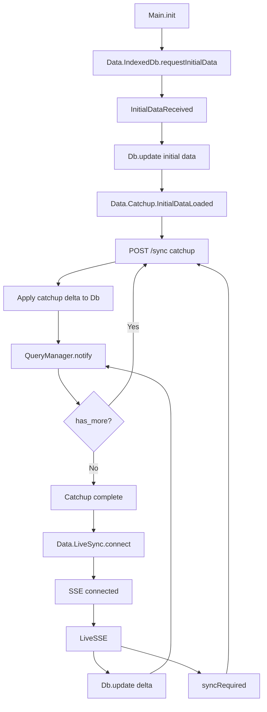

# Sync Behavior

For application setup and examples, use [Sync Setup](../../../docs/usage/sync.md). This document describes the worker implementation behind that public API.

## Startup sequence

1. **Elm init (`Main.elm`)**
   - `Main.init` starts the headless worker with flags (`schema`, `server`).
   - With auto-start enabled it sends `IndexedDb.requestInitialData`; otherwise explicit sync selection starts initialization.

2. **IndexedDB bootstrap (`Data.IndexedDb` + `Db`)**
   - The TS IndexedDB service returns `InitialDataReceived`.
   - `Main.handleIndexedDbIncoming` updates the in-memory `Db` and re-runs all registered queries.
   - The worker restores authoritative rows, per-row revision stamps (including tombstones), the revision floor, and the epoch. `Data.Catchup` resumes the persisted server cursor rather than advancing it from live-only rows.

3. **Catchup loop (`Data.Catchup`)**
    - Once initial data is loaded, `Data.Catchup` requests `/sync`.
    - The request includes the persisted `databaseEpoch` when one is known.
    - Each catchup response is converted to a delta and applied to the in-memory `Db`.
   - `Data.QueryManager` is notified so queries re-run.
   - The cursor is updated in memory and the loop continues until `has_more = false`.

4. **SSE handshake (`Data.LiveSync`)**
   - After catchup completes, `Main.elm` opens the SSE connection.
   - The server emits `connected` when the stream is live.

5. **Live updates (SSE deltas)**
    - `Data.LiveSync` delivers delta messages to `Main.handleLiveSyncIncoming`.
    - Deltas are applied to `Db`, and `Data.QueryManager` re-runs affected queries.
    - If the server sends `syncRequired` or `catchupRequired`, the client starts a POST catchup from its current cursor instead of applying a live delta.

## Flow diagram

## Key ordering guarantees

- Catchup starts immediately after `InitialDataLoaded`.
- SSE connects after catchup finishes, or after a catchup error so live recovery signals can still arrive.
- Query re-execution happens:
   - after IndexedDB bootstraps, and
   - after each catchup page, and
   - after each SSE delta.
- Authoritative catchup/live deltas are applied before local optimistic mutations are replayed.
- HTTP, live, and catchup authority pass through per-row revision fences. An older message for a different row can still be accepted; the global maximum revision is not proof that all earlier rows arrived. Exceptional recovery additionally establishes a whole-cache revision floor.
- Revision ordering applies only within the same `databaseEpoch`.
- The client persists `lastAppliedServerRevision` in IndexedDB metadata and restores it at startup.
- The client persists the server-issued `databaseEpoch` alongside the revision watermark.
- `syncRequired` / `catchupRequired` hints are not deduplicated against the global maximum revision: omitted rows may still be missing.
- Catchup pages carry a consistent snapshot revision and use the same per-row authority path. Ordinary same-epoch `connected` handshakes preserve readers and pending writes; they do not initiate a destructive reload. Missed deletions/permission removals across a delivery gap remain deferred (MEC-157), including the initial catchup/subscription gap.

## Database replacement

`databaseEpoch` is an opaque identity for one lifetime of a logical database. The server keeps it stable across ordinary writes and migrations and rotates it when cached state must be discarded.

When a catchup request supplies a different epoch, the server returns an explicit `reset` response without a data page. The client immediately clears in-memory data and optimistic state, atomically clears IndexedDB rows/cursors/revision while storing the new epoch, waits for that transaction to complete, and then restarts catchup with an empty cursor. Live messages also carry the epoch so revisions from different database lifetimes are never compared.

## Mutation Ordering

Pyre treats mutation request order, response order, and live-sync arrival order as separate concerns.

- The client assigns each mutation a stable `requestId`.
- The server response acknowledges that `requestId` and returns the normal mutation result.
- The client keeps in-flight optimistic mutations in request order until the server response accepts or rejects them.
- Authoritative live/catchup data is applied to the local DB first, then unsettled optimistic mutations are replayed over it.
- Live sync events carry `serverRevision`; clients fence each row against its own last accepted revision.
- The server may avoid echoing live sync events to the origin connection, but clients must not rely on that suppression for correctness.

The server allocates the monotonic `_pyre_sync` revision inside the write transaction, so delayed publication cannot stamp older values as newer. HTTP responses include normal operation results and permission-filtered incremental authority. Batches expose indexed results while authority contains final row values/removals, not intermediate grants.

Server integrations must await `result.sync(...)` after successful synced mutations, even without active subscribers. It uses the committed revision, sends live messages, and prepares `result.response` as `{ databaseEpoch, serverRevision, sync, result }` for affected-row operations. Serialize the response afterward.

One worker replays ordered optimistic intent over authoritative rows and publishes the resulting visible state to query and entity readers. Entity streams project worker snapshots; they do not independently apply HTTP, live, or IndexedDB authority. Rejection removes intent and replays later submissions. Supported complete scalar creates and existing-row updates/deletes can be predicted; omitted defaults/managed values keep creates server-only.

Pending edits are memory-only. Unknown transport/commit outcomes use exceptional fenced authority recovery without replaying writes. Explicit invalidation and epoch changes also reset readers and fence pre-reset responses. These paths are distinct from ordinary reconnect. IndexedDB v4 rebuilds legacy caches; accepted removals and their per-row stamps are persisted atomically so old responses cannot resurrect delivered tombstones.

## Public sync state

- `PyreClient.onSyncState(...)` reports the high-level lifecycle as:
  - `not_started` before catchup begins
  - `catching_up` while initial catchup is running
  - `live` once initial catchup completes, live sync is active, and all queries registered at that moment have been fulfilled against the fully caught-up local DB
- Per-table state is reported as:
  - `waiting` before a table is seen during catchup
  - `catching_up` after a table has appeared in catchup work but before global catchup completes
  - `live` after the client finishes initial catchup
